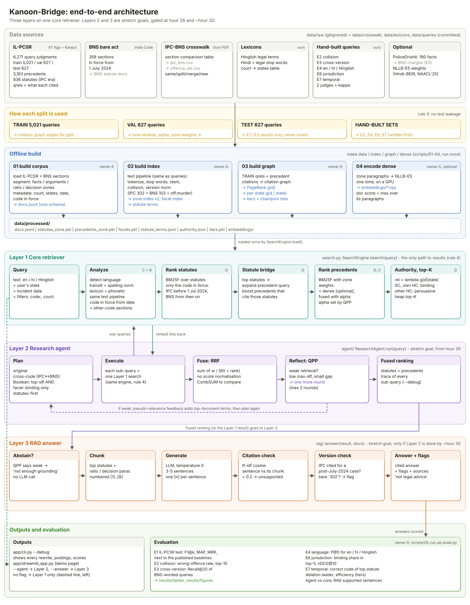

# Kanoon-Bridge

Legal search for Indian criminal law across the July 2024 IPC → BNS change.
One query — in BNS or IPC terms, in English, Hindi or Hinglish — finds the right statute
in both codes and the precedents that apply it, ranked by jurisdiction and date.

CSD358 (Information Retrieval) IR Hackathon · Track T6 (vertical search: law) with a T5 (Hinglish) layer.

> Not legal advice. This is a course research prototype.



Three layers on one core: **(1) core retriever** (required) → **(2) research agent** (stretch, from hour 26)
→ **(3) grounded RAG answer** (stretch, if layer 2 is done by ~hour 30). See `ARCHITECTURE.md`.

---

## Status

| Component | Owner | Status |
| --- | --- | --- |
| Shared schema, config, storage, text pipeline, search entry point | all | working |
| Data fetch, IL-PCSR loader, BNS loader, segmentation, metadata (courts, states, dates) | Gaurav | **working** |
| Crosswalk (496 IPC-BNS pairs), version normalisation, collision resolver | Gaurav | **working** |
| tf-idf, BM25F, statute bridge, citation graph, PageRank authority, QPP, tiers | Gaurav | **working** |
| Legal tokeniser (section tokens) | Sharanya | working baseline |
| Positional / zone / facet indexes, Boolean + proximity query parser | Sharanya | stub |
| Transliteration, phonetic matching, Hindi stemming, dense channel | Kashvi | stub |
| Research agent, layer 2 (RRF fusion + loop working) | Shaurya | wiring works, rules stub |
| Evaluation: test sets E1-E7, ablation ladder, language ablation, efficiency, plots | Gaurav | **working** |
| Agent vs core and RAG evaluation | Gaurav | **working** |
| RAG answer, layer 3: abstain, chunks, Claude/extractive generation, citation + version checks | Gaurav | **working** |

Update this table as components land. Stubs raise `NotImplementedError` with a TODO saying what to build.

---

> **Step-by-step guide to download every dataset and run everything (including the PDF
> cross-check and the RAG layer): [SETUP_AND_RUN.md](SETUP_AND_RUN.md).**

## Setup

```bash
git clone <repo-url> kanoon-bridge
cd kanoon-bridge
python -m venv .venv && source .venv/bin/activate     # Windows: .venv\Scripts\activate
pip install -e ".[dev]"            # core + pytest
pip install -e ".[dense]"          # optional: sentence-transformers for the dense channel
pip install -e ".[app]"            # optional: streamlit demo
make test                          # should pass on a fresh clone
```

Python 3.10+.

## Data

Downloads go in `data/raw/` (gitignored). One command fetches both sources:

```bash
pip install -e ".[data]"
huggingface-cli login              # IL-PCSR is gated: accept its terms on the dataset page first
make fetch                         # = python scripts/00_fetch_data.py
make check                         # PASS/MISSING per item + TODOs left per owner
```

| Data | Source | Lands in |
| --- | --- | --- |
| IL-PCSR (IIT Kharagpur + IIT Kanpur), CC-BY-NC-SA 4.0 | https://huggingface.co/datasets/Exploration-Lab/IL-PCSR | `data/raw/ilpcsr/<config>/<split>.parquet` |
| BNS bare-act text (358 sections) + each section's IPC correspondence | https://github.com/PSKprem/bns-study-platform (`data/sections/*.json`) | `data/raw/bns-study-platform/` |
| IPC↔BNS crosswalk (derived) | generated by `make crosswalk` from the source above | `data/crosswalk/*.csv` (committed) |
| Government comparison table (optional cross-check) | https://www.keralaprisons.gov.in/userfiles/act-and-rules/comparison_summary_BNS_to_IPC.pdf | `data/raw/crosswalk/` |
| PoliceDrishti (gated, optional) | https://huggingface.co/datasets/happyman11/PoliceDristi | `data/raw/policedrishti/` |
| NLLB-E5 weights (optional) | https://github.com/ArkadeepAcharya/NLLB-E5 | downloaded by `scripts/04_encode_dense.py` |

From the bns-study-platform repository we use only the bare-act text (government material) and the
section-number correspondences; none of its commentary.

**No Hugging Face access yet?** `make sample` runs the whole offline build on a tiny synthetic
sample in IL-PCSR's exact schema (`tests/data/`, fictional cases — never report results on it).
Step 02 needs the index build (Sharanya) to be implemented.

No crawling. If any is added later: obey robots.txt, rate-limit, collect no personal data.

## How to run

```bash
make data      # scripts/01_build_corpus.py  → crosswalk CSVs + data/processed/docs.jsonl
make index     # scripts/02_build_index.py   → data/processed/index/
make graph     # scripts/03_build_graph.py   → citation graph + authority scores
make dense     # scripts/04_encode_dense.py  → paragraph embeddings (GPU recommended)
make eval      # scripts/05_run_all_evals.py → results/tables, results/figures
make app       # streamlit demo
python app/cli.py "mere bhai ko chaku maara" --state delhi --date 2025-03-01 --debug
python app/cli.py "..." --agent            # layer 2: several sub-queries, fused
python app/cli.py "..." --answer           # layer 3: cited answer with checks (Claude if a key is in .env)
make compare   # crosswalk vs the government PDF (download it by hand first)
make eval-quick / make eval-sample / make plots
```

Until the index code (Sharanya) is merged, `export KB_DEV_SHIM=1` runs the pipeline with a clearly
labelled temporary stand-in (`src/kanoon_bridge/dev/reference_index.py`); see SETUP_AND_RUN.md.

## Repo layout

`ARCHITECTURE.md` explains the design end to end (data usage, worked example, evaluation, gates).
`PROJECT_STRUCTURE.md` lists every file: owner, status, purpose, and the functions it must contain.

## Team rules

1. Everything passes `schema.py` objects (`Document`, `Query`, `ScoredDoc`).
2. Documents and queries go through the same `text/` pipeline.
3. No test leakage: graph building and tuning use train/val only.
4. The app and the evaluator both call `kanoon_bridge.search.search()`.
5. Log AI use in `docs/ai_use.md` as you go.

## Credits

IL-PCSR (Paul et al., 2025), BNS bare-act text and IPC correspondences via the bns-study-platform project (PSKprem), Hindi-BEIR / NLLB-E5 (Acharya et al., NAACL 2025), CaseLink (Tang et al., SIGIR 2024),
QPP for agentic RAG (Tian et al., IR-RAG@SIGIR 2025), PoliceDrishti dataset. Spatio-temporal facets inspired by
the work of Dr. Sonia Khetarpaul (SNU).
